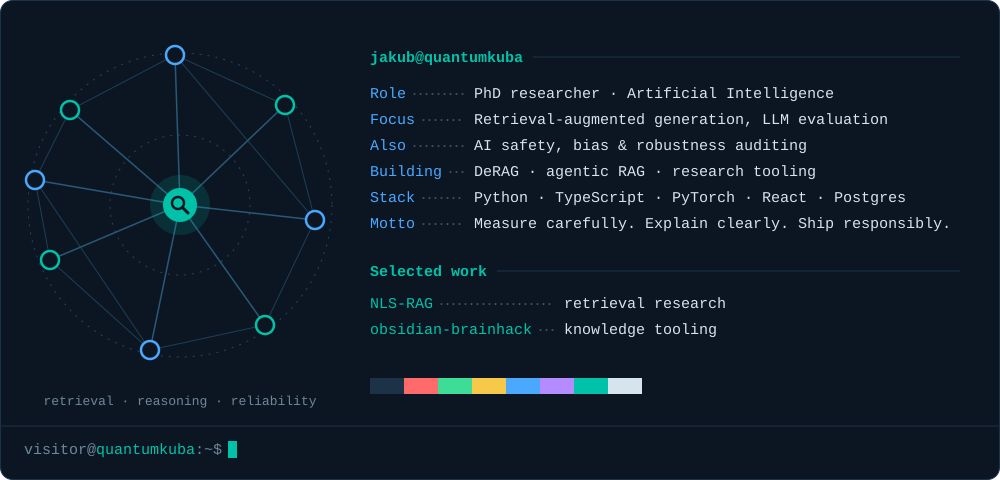

  <picture>
    <source media="(prefers-color-scheme: dark)" srcset="./assets/card-dark.svg" />
    <source media="(prefers-color-scheme: light)" srcset="./assets/card-light.svg" />
    
  </picture>

  

    <a href="https://github.com/QuantumKuba/NLS-RAG"><b>NLS-RAG</b></a> ·
    <a href="https://github.com/QuantumKuba/obsidian-brainhack"><b>obsidian-brainhack</b></a> ·
    <a href="https://github.com/QuantumKuba?tab=repositories">all repositories →</a>
  

  

